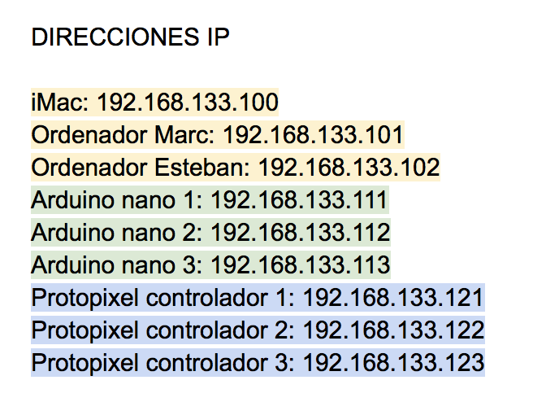
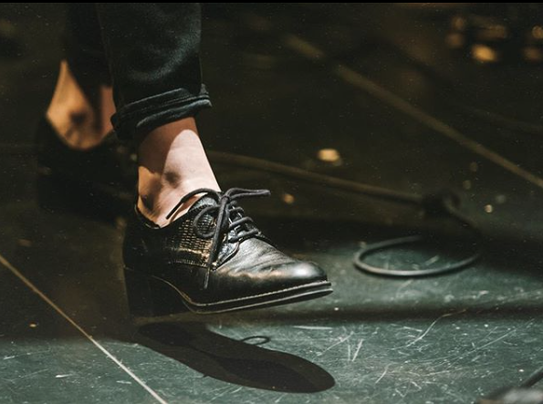

Overview
========

When music and space blend together.
The music of the band INTANA and the innovation from Fab Lab Barcelona / Institut d’Arquitectura Avançada de Catalunya (IAAC) join together to present a unique and experimental concert.

A live performance where space and the interpretation of sounds and lights will be one together, where technology and design will create an interactive atmosphere that will accompany and dialogue with the melodies and rhythms of the quartet formed by Núria Moliner, Guillem Callejón, Jordi Mestres and Ricard Parera.

The project, led by Marc Conangla (designer) and Núria Moliner (architect and composer), will be developed by a multidisciplinary team coordinated by Santi Fuentemilla (architect) and Esteban Giménez (engineer and programmer) with Fab Lab Barcelona (IAAC) as the main collaborator, and staged on April 26 in the auditorium of La Pedrera, Barcelona. 


Process
=======

Coding
------

Flatdoc is a small JavaScript file that fetches Markdown files and renders them
as full pages. Essentially, it's the easiest
way to make open source documentation from *Readme* files.


``` javascript
Flatdoc.run({
  fetcher: Flatdoc.github('USER/REPO')
});
```

Prototypes
----------


Misc
====


Inspirations
-------------

The following projects have inspired Flatdoc.

 * [Backbone.js] - Jeremy's projects have always adopted this "one page
 documentation" approach which I really love.

 * [Docco] - Jeremy's Docco introduced me to the world of literate programming,
 and side-by-side documentation in general.

 * [Stripe] - Flatdoc took inspiration on the look of their API documentation.

 * [DocumentUp] - This service has the same idea but does a hosted readme 
 parsing approach.


[rsc]: http://ricostacruz.com
[c]:   http://github.com/rstacruz/flatdoc/contributors

[GitHub API]: http://github.com/api
[marked]: https://github.com/chjj/marked
[Backbone.js]: http://backbonejs.org
[dox]: https://github.com/visionmedia/dox
[Stripe]: https://stripe.com/docs/api
[Docco]: http://jashkenas.github.com/docco
[GitHub pages]: https://pages.github.com
[fences]:https://help.github.com/articles/github-flavored-markdown#syntax-highlighting
[DocumentUp]: http://documentup.com

[project]: https://github.com/rstacruz/flatdoc
[template]: https://github.com/rstacruz/flatdoc/raw/gh-pages/templates/template.html
[blank]: https://github.com/rstacruz/flatdoc/raw/gh-pages/templates/blank.html
[dist]: https://github.com/rstacruz/flatdoc/tree/gh-pages/v/0.9.0


Attributions
-------------

**Intana**

Web: http://intanamusic.com/

Facebook: https://www.facebook.com/intanamusic

Twitter: https://twitter.com/intana_music

Instagram: https://www.instagram.com/intana_music/

Spotify: https://open.spotify.com/artist/1MJy23jZGgB8MH8h2lLz0u

Núria Moliner, Guillem Callejón, Jordi Mestres i Ricard Parera


**FablabBCN**

Web: https://fablabbcn.org/

Facebook: https://www.facebook.com/FabLab.BCN/

Twitter: https://twitter.com/fablabbcn

Instagram: https://www.instagram.com/fablabbcn/

Marc Conangla: http://archive.fabacademy.org/archives/2017/fablabbcn/students/421/

Esteban Giménez: http://archive.fabacademy.org/archives/2017/fablabbcn/students/271/

Santi Fuentemilla:
https://iaac.net/people/santi-fuentemilla/


**IAAC** 

Web: https://iaac.net/

Facebook: https://www.facebook.com/IAACbcn/

Twitter: https://twitter.com/iaac

Instagram: https://www.instagram.com/iaacbcn/


**Pedrera-Artlab**

Flatdoc offers a few harmless, unobtrusive extras that come in handy in building
documentation sites.




